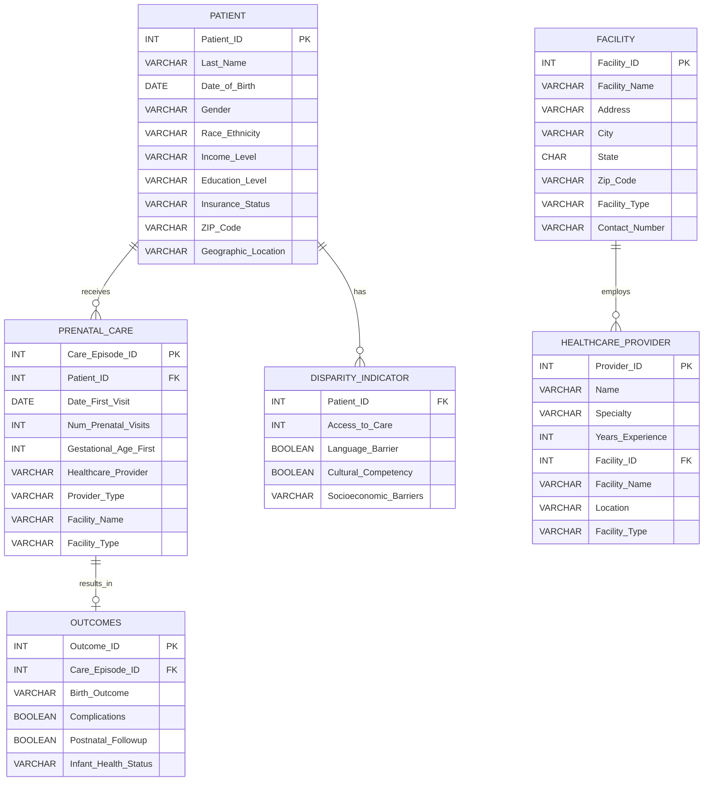

# Entity Relationship Diagram

This ERD shows the core relationships between patients, prenatal care visits, facilities, providers, outcomes, and disparity indicators.

```mermaid
erDiagram
    PATIENT ||--o{ PRENATAL_CARE : receives
    PATIENT ||--o{ DISPARITY_INDICATOR : has
    PRENATAL_CARE ||--o| OUTCOMES : results_in
    FACILITY ||--o{ HEALTHCARE_PROVIDER : employs

    PATIENT {
        INT Patient_ID PK
        VARCHAR Last_Name
        DATE Date_of_Birth
        VARCHAR Gender
        VARCHAR Race_Ethnicity
        VARCHAR Income_Level
        VARCHAR Education_Level
        VARCHAR Insurance_Status
        VARCHAR ZIP_Code
        VARCHAR Geographic_Location
    }

    PRENATAL_CARE {
        INT Care_Episode_ID PK
        INT Patient_ID FK
        DATE Date_First_Visit
        INT Num_Prenatal_Visits
        INT Gestational_Age_First
        VARCHAR Healthcare_Provider
        VARCHAR Provider_Type
        VARCHAR Facility_Name
        VARCHAR Facility_Type
    }

    HEALTHCARE_PROVIDER {
        INT Provider_ID PK
        VARCHAR Name
        VARCHAR Specialty
        INT Years_Experience
        INT Facility_ID FK
        VARCHAR Facility_Name
        VARCHAR Location
        VARCHAR Facility_Type
    }

    FACILITY {
        INT Facility_ID PK
        VARCHAR Facility_Name
        VARCHAR Address
        VARCHAR City
        CHAR State
        VARCHAR Zip_Code
        VARCHAR Facility_Type
        VARCHAR Contact_Number
    }

    OUTCOMES {
        INT Outcome_ID PK
        INT Care_Episode_ID FK
        VARCHAR Birth_Outcome
        BOOLEAN Complications
        BOOLEAN Postnatal_Followup
        VARCHAR Infant_Health_Status
    }

    DISPARITY_INDICATOR {
        INT Patient_ID FK
        INT Access_to_Care
        BOOLEAN Language_Barrier
        BOOLEAN Cultural_Competency
        VARCHAR Socioeconomic_Barriers
    }
```
